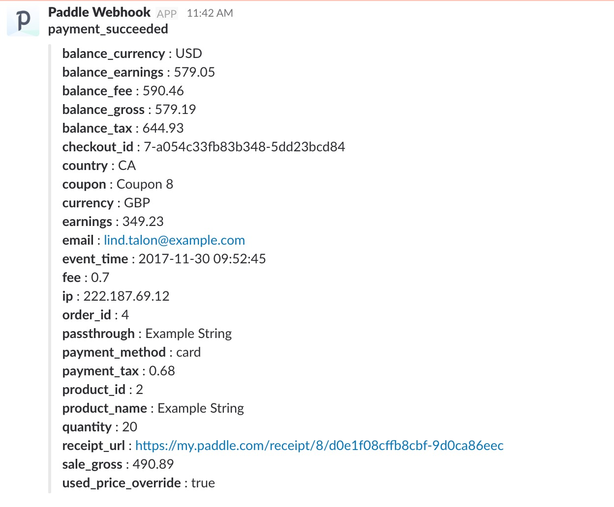

# PaddleWebhooksToSlack
PHP to receive Paddle's webhooks and post them into a Slack room.

1. Create an integration in Slack. (Browse Apps -> Custom Integrations -> Incoming WebHooks)
2. Copy the webhook URL.
3. Host this `slackPivot.php` file online somewhere.
4. Set the URL from step 3 as the webhook URL in your Paddle Vendor dashboard (or forward the payload from your business logic webhook file).
5. Enjoy notifications in your Slack.



## Example Test Curl

```shell
curl -X POST -d 'alert_name=payment_succeeded' \
    -d 'balance_currency=USD' \
    -d 'balance_earning=579.05' \
    -d 'balance_fee=590.46' \
    -d 'balance_gross=579.19' \
    -d 'balance_tax=644.93' \
    -d 'checkout_id=7-a054c33fb83b348-5dd23bcd84' \
    -d 'country=CA' \
    -d 'coupon=Coupon+8' \
    -d 'currency=GBP' \
    -d 'earnings=349.23' \
    -d 'email=lind.talon%40example.com' \
    -d 'event_time=2017-11-30+09%3A52%3A45' \
    -d 'fee=0.7' \
    -d 'ip=222.187.69.1' \
    -d 'order_id=4' \
    -d 'passthrough=Example+String' \
    -d 'payment_method=card' \
    -d 'payment_tax=0.68' \
    -d 'product_id=2' \
    -d 'product_name=Example+String' \
    -d 'quantity=2' \
    -d 'receipt_url=https%3A%2F%2Fmy.paddle.com%2Freceipt%2F8%2Fd0e1f08cffb8cbf-9d0ca86eec' \
    -d 'sale_gross=490.89' \
    -d 'used_price_override=true' \
    -d 'p_signature=myyqP7I80dnkTx%2B8baITbNNX8%2F3pNlGYI5V50PVCNclkHN%2B%2FMteWNCB9G8jOLyhMP9O5z%2BgOgtQukjc4iPAv6LRARq48MBVim2Aqbxgfm0pR9XDqqAjyAmBg4%2F97%2By6h53Ungbo4Bes9uiez0eYENSbCvAuq71JesphCpE3J%2F1pqbQEohZRqwlZqZcPteoxAjD0eDFVgIL9s2LkRd4OJuqw4q8wM9neALUR6xJODziDxGLi33GEDMAInW6sMByH8%2FSslus68Z4w%2B6%2FfNO6zguOgi9W8t5ulr2DkwD419psRIICYwYOfl%2Bd7BXNAWkoq7tpbnM5hAgkilikHvQ5Z2zKI6Yc113Rt2g1dU%2Fy2geuiP2tFr97z22%2BCaFk6uvOqWClg%2FqGv5gkjTFpA2fu8xwOF%2FVbGqGpZJ3FtJZ%2Fw3i5%2Fldl5eP8spF8kSYVJQ3VXJhqwcDZ4RpGpCxVBLG40niv%2FFAE8K82QRoaXfA%2FA410p1QMIOeNCjr%2FoKbGpkCVTpmrB3U7vKVk0vdVf0dnqDvvbpIlGZjXKcgxIz88eEVVWxuaUYdy8Btb%2FED44DbWstPn1yyLBsonJIirYWWvAphnD%2Bs%2FmDZ01sJUXfiIRyODsVIrUlZHNZYwkzcUTIe2vzGn%2FbHY5sSZpdpnviGg8lNwi%2BwuBtMrS500vFVmujheY%3D' \
    http://localhost/slackPivot.php
```
